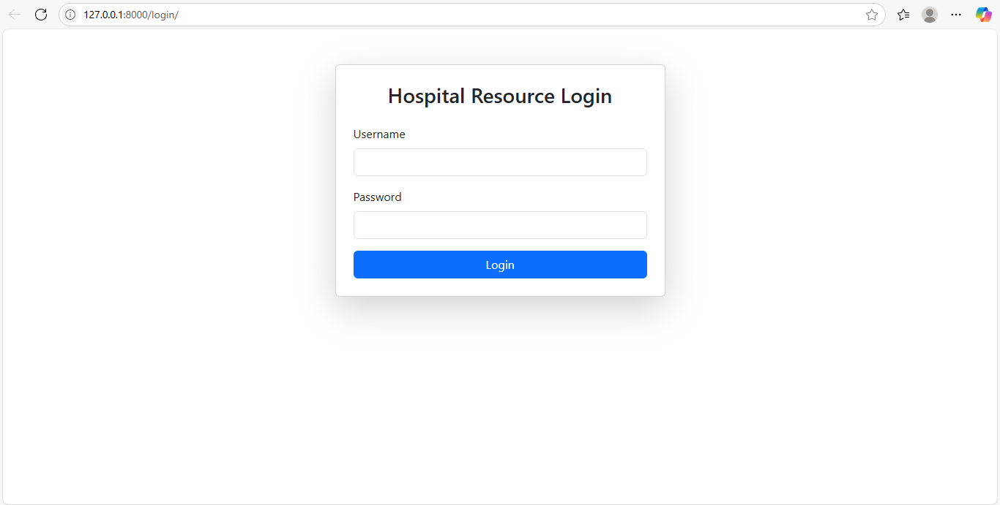

# 🏥 Hospital Resource Management System

An **AI-powered Django web app** for managing and predicting hospital resources such as **Oxygen Cylinders**, **PPE Kits**, and **ICU Beds**.  
This system helps hospitals anticipate future resource needs based on past usage trends using **Machine Learning**.

---

## 📚 Table of Contents

- [🚀 Features](#-features)
- [🧠 AI Model Overview](#-ai-model-overview)
- [🛠️ Tech Stack](#️-tech-stack)
- [📁 Project Structure](#-project-structure)
- [⚙️ Installation](#️-installation)
- [👥 User Roles](#-user-roles)
- [📸 Screenshots](#-screenshots)
- [📈 Future Enhancements](#-future-enhancements)
- [🤝 Contributing](#-contributing)
- [📄 License](#-license)

---

## 🚀 Features

✅ Role-Based Access: **Admin**, **Doctor**, and **Staff**  
✅ Daily usage input for Oxygen, PPE Kits, ICU Beds  
✅ Forecasts resource requirements for the **next day**  
✅ Interactive dashboard with stats and predictions  
✅ Clean UI with HTML, CSS, and Bootstrap  
✅ Uses AI model built with **scikit-learn**

---

## 🧠 AI Model Overview

- **Algorithm:** Linear Regression  
- **Input:** Last 7 days of usage for each resource  
- **Output:** Predicted quantity for the next day  
- **Technology:** Python, Pandas, Scikit-learn  

> 📌 Example: If last 7 days of oxygen usage were [23, 25, 24, 26, 27, 28, 29]  
> The model predicts day 8 usage using regression.

---

## 🛠️ Tech Stack

| Category      | Technology            |
|---------------|------------------------|
| Backend       | Django (Python)        |
| ML Model      | scikit-learn, pandas   |
| Frontend      | HTML, CSS, Bootstrap   |
| Database      | SQLite (Django ORM)    |
| Editor        | VS Code                |

---

## 📁 Project Structure

```
Hospital_Resource_Management_System/
│
├── ai_model/                  # Machine Learning logic
│   └── predict.py
│
├── dashboard/                 # Frontend templates
│   └── templates/
│
├── hospital/                  # Core Django app
│   ├── models.py
│   ├── views.py
│   ├── forms.py
│   └── urls.py
│
├── static/                    # CSS, JS, images
├── db.sqlite3                 # Default SQLite DB
├── manage.py
└── requirements.txt
```

---

## ⚙️ Installation

### 1. Clone the Repository

```bash
git clone https://github.com/TusharPanchal55/Hospital_Resource_Management_System.git
cd Hospital_Resource_Management_System
```

### 2. Create a Virtual Environment

```bash
python -m venv env
source env/bin/activate  # On Windows use: env\Scripts\activate
```

### 3. Install Requirements

```bash
pip install -r requirements.txt
```

### 4. Apply Migrations

```bash
python manage.py makemigrations
python manage.py migrate
```

### 5. Run the Server

```bash
python manage.py runserver
```

➡️ Open in browser: [http://127.0.0.1:8000](http://127.0.0.1:8000)

---

## 👥 User Roles

| Role    | Privileges |
|---------|------------|
| **Admin** | Full access: dashboard, user management, predictions |
| **Doctor** | Can input usage data and view forecasts |
| **Staff** | Limited data entry access only |

---

## 📸 Screenshots

> *(Add screenshots in the repo folder and link them here like below)*

```markdown




```

---

## 📈 Future Enhancements

- 🔄 Real-time data sync from hospital devices (IoT)
- 📨 Email alerts for predicted shortages
- ☁️ Cloud deployment (Heroku/AWS)
- 📊 Advanced prediction (LSTM / Time-series models)

---

## 🤝 Contributing

Contributions are welcome!  
Please fork the repository and submit a Pull Request for review.

```bash
git checkout -b feature-branch
git commit -m "Add new feature"
git push origin feature-branch
```

---

## 📄 License

This project is licensed under the **MIT License**.  
Feel free to use, modify, and distribute.

---

## 🙋‍♂️ Author

**Tushar Panchal**  
📧 [Contact on LinkedIn](https://www.linkedin.com/in/tusharpanchal55)
